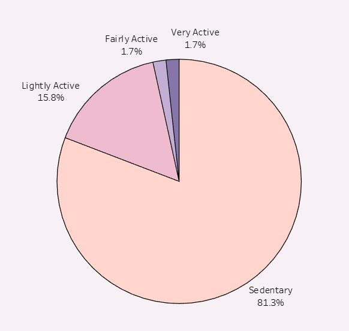
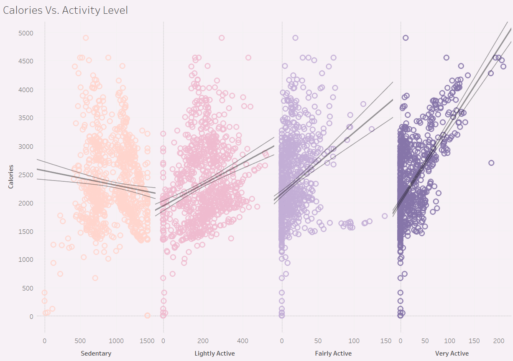
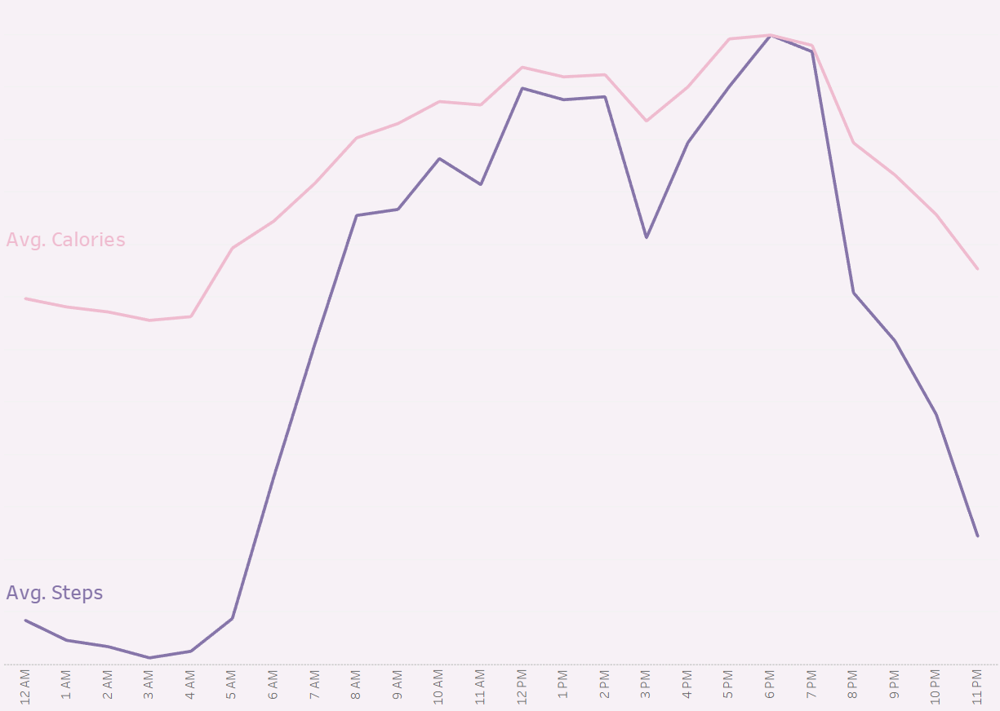
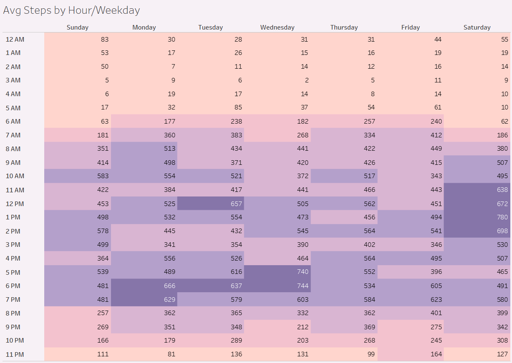

# Introduction
This is my data analysis project for Bellabeat, a women's health tech company. The project utilizes Python, SQL, and Tableau to analyze user smart device data, aiming to uncover insights for optimizing Bellabeat's marketing strategy. It encompasses data preparation in PostgreSQL, thorough data cleaning, and detailed analysis, with the goal of providing actionable recommendations to enhance Bellabeat's engagement with its target audience and improve its digital marketing efforts.

# Background
Bellabeat was founded in 2013 by Urška Sršen and Sando Mur with the goal of developing beautifully designed technology that would inform and inspire women. The technology would collect data on activity, sleep, stress, and reproductive health to empower women with knowledge about their own health.

Bellabeat products are available at a number of online retailers in addition to their website. The company has invested in traditional advertising media such as radio, billboards, print, and television, but focuses on digital marketing extensively. They have ads on Youtube and Google, and are active on multiple social media platforms including Facebook, Instagram, and Twitter.

#### Bellabeat Products
- **Bellabeat App:** provides users with health data related to their activity, sleep, stress, menstrual cycle, and mindfulness habits. 
- **Leaf:** A wellness tracker that can be worn as a bracelet, necklace, or clip and connects to the Bellabeat app to track activity, sleep, and stress.
- **Time:** A wellness watch with smart technology and connects to the Bellabeat app to track user activity, sleep, and stress.
- **Spring:** A water bottle with smart technology and connects to the Bellabeat app to track daily water intake.
- **Bellabeat Membership:** A subscription-based membership program for users to have 24/7 access to fully personalized guidance on nutrition, activity, sleep, health and beauty, and mindfulness based on their lifestyle and goals.


### Business Task

Analyze smart device data to gain insight on how consumers use smart devices and answer the following questions:

- What are some trends in smart device usage?
- How could these trends apply to Bellabeat customers?
- How could these trends help influence Bellabeat marketing strategy?


### Prepare Data

The dataset was obtained from [Kaggle](https://www.kaggle.com/datasets/arashnic/fitbit). There were 18 CSV files containing FitBit tracker data from 33 users collected from 4/12/2016 to 5/12/2016. I deployed a PostgreSQL database on AWS and imported the CSV files to the database. After verifying that a table was created for each CSV file, I proceeded to simplify the dataset by combining and dropping tables.

- The `dailycalories`, `dailyintensities`, and `dailysteps` tables where dropped as the data already existed in the `dailyactivity` table. 
- A new table with hourly data was created by joining the `hourlycalories`, `hourlyintensities`, and `hourlysteps` tables; the 3 tables were subsequently dropped.
- Tables containing minute data were dropped as the data is too granular to extract any meaningful insights. 

In summary, the following tables were dropped:
* `dailycalories`
* `dailyintensities`
* `dailysteps`
* `hourlycalories`
* `hourlyintensities`
* `hourlysteps`
* `minutecaloriesnarrow`
* `minutecalorieswide`
* `minuteintensitiesnarrow`
* `minuteintensitieswide`
* `minutemetsnarrow`
* `minutesleep`
* `minutestepsnarrow`
* `minutestepswide`
* `heartrate_seconds`
* `weightloginfo`

The following tables remained in the database:
* `dailyactivity`
* `hourlydata`
* `sleepday`


```python
#Import libraries
import pandas as pd
import psycopg2
import sqlalchemy
import csv
import os
%load_ext sql

#Connect to SQL database
connect_url = 'postgresql://{}:{}@{}:{}/{}'.format(user,password,host,port,db)
engine = sqlalchemy.create_engine(connect_url)
%sql $connect_url
%config SqlMagic.displaycon = False
```


```python
#Read multiple CSV files and load into SQL database
import glob 
import os
file_names = glob.glob('data/*.csv')

for names in file_names:
    tablename = os.path.basename(names)
    tablename, ext = os.path.splitext(tablename)
    df = pd.read_csv(names)
    df.columns = df.columns.str.lower() #convert column names to lower case
    df.to_sql(tablename, engine, if_exists='replace', index=False)
```


```sql
%%sql
-- Verify tables in database
SELECT table_name
FROM information_schema.tables
WHERE table_schema = 'public';
```

    18 rows affected.
    


<table>
    <thead>
        <tr>
            <th>table_name</th>
        </tr>
    </thead>
    <tbody>
        <tr>
            <td>minutecalorieswide</td>
        </tr>
        <tr>
            <td>minuteintensitiesnarrow</td>
        </tr>
        <tr>
            <td>minuteintensitieswide</td>
        </tr>
        <tr>
            <td>minutemetsnarrow</td>
        </tr>
        <tr>
            <td>minutesleep</td>
        </tr>
        <tr>
            <td>minutestepsnarrow</td>
        </tr>
        <tr>
            <td>minutestepswide</td>
        </tr>
        <tr>
            <td>sleepday</td>
        </tr>
        <tr>
            <td>weightloginfo</td>
        </tr>
        <tr>
            <td>dailyactivity</td>
        </tr>
        <tr>
            <td>dailycalories</td>
        </tr>
        <tr>
            <td>dailyintensities</td>
        </tr>
        <tr>
            <td>dailysteps</td>
        </tr>
        <tr>
            <td>heartrate_seconds</td>
        </tr>
        <tr>
            <td>hourlycalories</td>
        </tr>
        <tr>
            <td>hourlyintensities</td>
        </tr>
        <tr>
            <td>hourlysteps</td>
        </tr>
        <tr>
            <td>minutecaloriesnarrow</td>
        </tr>
    </tbody>
</table>


```sql
%%sql
-- Join hourly tables and create new table
CREATE TABLE hourlydata AS(
SELECT c.id,
       c.activityhour,
       c.calories,
       i.totalintensity,
       i.averageintensity,
       s.steptotal
FROM hourlycalories AS c
FULL OUTER JOIN hourlyintensities AS i
    ON c.id = i.id
    AND c.activityhour = i.activityhour
FULL OUTER JOIN hourlysteps AS s
    ON i.id = s.id
    AND i.activityhour = s.activityhour
);
```

    22099 rows affected.
    


    []


```sql
%%sql
--Verify new table
SELECT *
FROM hourlydata
LIMIT 10;
```

    10 rows affected.
    


<table>
    <thead>
        <tr>
            <th>id</th>
            <th>activityhour</th>
            <th>calories</th>
            <th>totalintensity</th>
            <th>averageintensity</th>
            <th>steptotal</th>
        </tr>
    </thead>
    <tbody>
        <tr>
            <td>1503960366</td>
            <td>4/12/2016 12:00:00 AM</td>
            <td>81</td>
            <td>20</td>
            <td>0.333333</td>
            <td>373</td>
        </tr>
        <tr>
            <td>1503960366</td>
            <td>4/12/2016 1:00:00 AM</td>
            <td>61</td>
            <td>8</td>
            <td>0.133333</td>
            <td>160</td>
        </tr>
        <tr>
            <td>1503960366</td>
            <td>4/12/2016 2:00:00 AM</td>
            <td>59</td>
            <td>7</td>
            <td>0.116667</td>
            <td>151</td>
        </tr>
        <tr>
            <td>1503960366</td>
            <td>4/12/2016 3:00:00 AM</td>
            <td>47</td>
            <td>0</td>
            <td>0.0</td>
            <td>0</td>
        </tr>
        <tr>
            <td>1503960366</td>
            <td>4/12/2016 4:00:00 AM</td>
            <td>48</td>
            <td>0</td>
            <td>0.0</td>
            <td>0</td>
        </tr>
        <tr>
            <td>1503960366</td>
            <td>4/12/2016 5:00:00 AM</td>
            <td>48</td>
            <td>0</td>
            <td>0.0</td>
            <td>0</td>
        </tr>
        <tr>
            <td>1503960366</td>
            <td>4/12/2016 6:00:00 AM</td>
            <td>48</td>
            <td>0</td>
            <td>0.0</td>
            <td>0</td>
        </tr>
        <tr>
            <td>1503960366</td>
            <td>4/12/2016 7:00:00 AM</td>
            <td>47</td>
            <td>0</td>
            <td>0.0</td>
            <td>0</td>
        </tr>
        <tr>
            <td>1503960366</td>
            <td>4/12/2016 8:00:00 AM</td>
            <td>68</td>
            <td>13</td>
            <td>0.216667</td>
            <td>250</td>
        </tr>
        <tr>
            <td>1503960366</td>
            <td>4/12/2016 9:00:00 AM</td>
            <td>141</td>
            <td>30</td>
            <td>0.5</td>
            <td>1864</td>
        </tr>
    </tbody>
</table>


```sql
%%sql
-- Drop tables not used
DROP TABLE IF EXISTS dailycalories, dailyintensities, dailysteps, hourlycalories, hourlyintensities, hourlysteps, minutecaloriesnarrow, minutecalorieswide, minuteintensitiesnarrow, minuteintensitieswide, minutemetsnarrow, minutesleep, minutestepsnarrow, minutestepswide, heartrate_seconds, weightloginfo;

-- Verify tables in database
SELECT table_name
FROM information_schema.tables
WHERE table_schema = 'public';
```

    Done.
    3 rows affected.
    


<table>
    <thead>
        <tr>
            <th>table_name</th>
        </tr>
    </thead>
    <tbody>
        <tr>
            <td>sleepday</td>
        </tr>
        <tr>
            <td>dailyactivity</td>
        </tr>
        <tr>
            <td>hourlydata</td>
        </tr>
    </tbody>
</table>


### Clean Data

3 Tables remained in the database: `dailyactivity`, `hourlydata`, and `sleepday`. After reviewing each table, including the column names and data types, I proceeded to check for any duplicates or null values.

- In `sleepday` table, the `sleepday` column was renamed to sleepdate to avoid confusion.
- In `sleepday` table, the `sleepdate` column was changed to a date data type.
- In `dailyactivity` table, the `activitydate` column was changed to a date data type.
- In `hourlydata` table, the `activityhour` column was changed to a timestamp data type.
- Tables were checked for duplicate rows
    - In `sleepday` table, 3 duplicate rows were found and deleted


```sql
%%sql
-- Review table columns and data types
SELECT c.table_name,
       c.column_name,
       c.data_type
FROM information_schema.columns c
JOIN information_schema.tables t
ON c.table_name = t.table_name
WHERE c.table_schema = 'public'
ORDER BY table_name, column_name;
```

    26 rows affected.
    


<table>
    <thead>
        <tr>
            <th>table_name</th>
            <th>column_name</th>
            <th>data_type</th>
        </tr>
    </thead>
    <tbody>
        <tr>
            <td>dailyactivity</td>
            <td>activitydate</td>
            <td>date</td>
        </tr>
        <tr>
            <td>dailyactivity</td>
            <td>calories</td>
            <td>bigint</td>
        </tr>
        <tr>
            <td>dailyactivity</td>
            <td>fairlyactiveminutes</td>
            <td>bigint</td>
        </tr>
        <tr>
            <td>dailyactivity</td>
            <td>id</td>
            <td>bigint</td>
        </tr>
        <tr>
            <td>dailyactivity</td>
            <td>lightactivedistance</td>
            <td>double precision</td>
        </tr>
        <tr>
            <td>dailyactivity</td>
            <td>lightlyactiveminutes</td>
            <td>bigint</td>
        </tr>
        <tr>
            <td>dailyactivity</td>
            <td>loggedactivitiesdistance</td>
            <td>double precision</td>
        </tr>
        <tr>
            <td>dailyactivity</td>
            <td>moderatelyactivedistance</td>
            <td>double precision</td>
        </tr>
        <tr>
            <td>dailyactivity</td>
            <td>sedentaryactivedistance</td>
            <td>double precision</td>
        </tr>
        <tr>
            <td>dailyactivity</td>
            <td>sedentaryminutes</td>
            <td>bigint</td>
        </tr>
        <tr>
            <td>dailyactivity</td>
            <td>totaldistance</td>
            <td>double precision</td>
        </tr>
        <tr>
            <td>dailyactivity</td>
            <td>totalsteps</td>
            <td>bigint</td>
        </tr>
        <tr>
            <td>dailyactivity</td>
            <td>trackerdistance</td>
            <td>double precision</td>
        </tr>
        <tr>
            <td>dailyactivity</td>
            <td>veryactivedistance</td>
            <td>double precision</td>
        </tr>
        <tr>
            <td>dailyactivity</td>
            <td>veryactiveminutes</td>
            <td>bigint</td>
        </tr>
        <tr>
            <td>hourlydata</td>
            <td>activityhour</td>
            <td>timestamp without time zone</td>
        </tr>
        <tr>
            <td>hourlydata</td>
            <td>averageintensity</td>
            <td>double precision</td>
        </tr>
        <tr>
            <td>hourlydata</td>
            <td>calories</td>
            <td>bigint</td>
        </tr>
        <tr>
            <td>hourlydata</td>
            <td>id</td>
            <td>bigint</td>
        </tr>
        <tr>
            <td>hourlydata</td>
            <td>steptotal</td>
            <td>bigint</td>
        </tr>
        <tr>
            <td>hourlydata</td>
            <td>totalintensity</td>
            <td>bigint</td>
        </tr>
        <tr>
            <td>sleepday</td>
            <td>id</td>
            <td>bigint</td>
        </tr>
        <tr>
            <td>sleepday</td>
            <td>sleepdate</td>
            <td>date</td>
        </tr>
        <tr>
            <td>sleepday</td>
            <td>totalminutesasleep</td>
            <td>bigint</td>
        </tr>
        <tr>
            <td>sleepday</td>
            <td>totalsleeprecords</td>
            <td>bigint</td>
        </tr>
        <tr>
            <td>sleepday</td>
            <td>totaltimeinbed</td>
            <td>bigint</td>
        </tr>
    </tbody>
</table>


```sql
%%sql
SELECT *
FROM sleepday
LIMIT 10;
```

    10 rows affected.
    


<table>
    <thead>
        <tr>
            <th>id</th>
            <th>sleepdate</th>
            <th>totalsleeprecords</th>
            <th>totalminutesasleep</th>
            <th>totaltimeinbed</th>
        </tr>
    </thead>
    <tbody>
        <tr>
            <td>1503960366</td>
            <td>2016-04-12</td>
            <td>1</td>
            <td>327</td>
            <td>346</td>
        </tr>
        <tr>
            <td>1503960366</td>
            <td>2016-04-13</td>
            <td>2</td>
            <td>384</td>
            <td>407</td>
        </tr>
        <tr>
            <td>1503960366</td>
            <td>2016-04-15</td>
            <td>1</td>
            <td>412</td>
            <td>442</td>
        </tr>
        <tr>
            <td>1503960366</td>
            <td>2016-04-16</td>
            <td>2</td>
            <td>340</td>
            <td>367</td>
        </tr>
        <tr>
            <td>1503960366</td>
            <td>2016-04-17</td>
            <td>1</td>
            <td>700</td>
            <td>712</td>
        </tr>
        <tr>
            <td>1503960366</td>
            <td>2016-04-19</td>
            <td>1</td>
            <td>304</td>
            <td>320</td>
        </tr>
        <tr>
            <td>1503960366</td>
            <td>2016-04-20</td>
            <td>1</td>
            <td>360</td>
            <td>377</td>
        </tr>
        <tr>
            <td>1503960366</td>
            <td>2016-04-21</td>
            <td>1</td>
            <td>325</td>
            <td>364</td>
        </tr>
        <tr>
            <td>1503960366</td>
            <td>2016-04-23</td>
            <td>1</td>
            <td>361</td>
            <td>384</td>
        </tr>
        <tr>
            <td>1503960366</td>
            <td>2016-04-24</td>
            <td>1</td>
            <td>430</td>
            <td>449</td>
        </tr>
    </tbody>
</table>


```sql
%%sql
--Rename sleepday column
ALTER TABLE sleepday
RENAME COLUMN sleepday TO sleepdate;
--Change activitydate type to date
ALTER TABLE dailyactivity
ALTER COLUMN activitydate TYPE date USING activitydate::date;
--Change sleepdate type to date
ALTER TABLE sleepday
ALTER COLUMN sleepdate TYPE date USING sleepdate::date;
--Change activityhour type to timestamp
ALTER TABLE hourlydata
ALTER COLUMN activityhour TYPE timestamp USING activityhour::timestamp;
```


```sql
%%sql
--Check for null values in tables
SELECT column_name 
FROM information_schema.columns 
WHERE table_name = 'dailyactivity' 
AND table_schema = 'public' 
AND is_nullable = 'YES' 
AND EXISTS (
    SELECT 1 FROM dailyactivity WHERE column_name IS NULL);

SELECT column_name 
FROM information_schema.columns 
WHERE table_name = 'sleepday' 
AND table_schema = 'public' 
AND is_nullable = 'YES' 
AND EXISTS (
    SELECT 1 FROM sleepday WHERE column_name IS NULL);

SELECT column_name 
FROM information_schema.columns 
WHERE table_name = 'hourlydata' 
AND table_schema = 'public' 
AND is_nullable = 'YES' 
AND EXISTS (
    SELECT 1 FROM hourlydata WHERE column_name IS NULL);
```

    0 rows affected.
    0 rows affected.
    0 rows affected.
    


<table>
    <thead>
        <tr>
            <th>column_name</th>
        </tr>
    </thead>
    <tbody>
    </tbody>
</table>


```sql
%%sql
--Check for duplicates
SELECT id,
       activitydate,
       COUNT(*)
FROM dailyactivity
GROUP BY id, activitydate
ORDER BY COUNT(*) DESC;

SELECT id,
       activityhour,
       COUNT(*)
FROM hourlydata
GROUP BY id, activityhour
ORDER BY COUNT(*) DESC;

SELECT id,
       sleepdate,
       COUNT(*)
FROM sleepday
GROUP BY id, sleepdate
ORDER BY COUNT(*) DESC
LIMIT 5;
```

    940 rows affected.
    22099 rows affected.
    5 rows affected.
    


<table>
    <thead>
        <tr>
            <th>id</th>
            <th>sleepdate</th>
            <th>count</th>
        </tr>
    </thead>
    <tbody>
        <tr>
            <td>4388161847</td>
            <td>2016-05-05</td>
            <td>2</td>
        </tr>
        <tr>
            <td>8378563200</td>
            <td>2016-04-25</td>
            <td>2</td>
        </tr>
        <tr>
            <td>4702921684</td>
            <td>2016-05-07</td>
            <td>2</td>
        </tr>
        <tr>
            <td>7086361926</td>
            <td>2016-05-01</td>
            <td>1</td>
        </tr>
        <tr>
            <td>6962181067</td>
            <td>2016-05-05</td>
            <td>1</td>
        </tr>
    </tbody>
</table>


```sql
%%sql
--Drop duplicates
DELETE
FROM sleepday
WHERE ctid IN (SELECT ctid
               FROM (SELECT ctid,
                            ROW_NUMBER() OVER (PARTITION BY id, sleepday) AS rn
                     FROM sleepday) AS temptable
               WHERE rn > 1);
```

    3 rows affected.
    


    []


### Analyze Data

After cleaning the data, I connected the dataset to Tableau to build visualizations and extract insights. My Tableau workbook can be found [here.](https://public.tableau.com/views/bellabeat_dashboard_16815197263150/Dashboard1?:language=en-US&:display_count=n&:origin=viz_share_link)


This bar chart illustrates the number of days each user tracked their activity. The majority of users tracked their activity for at least 30 days. Only a subset of 22 users tracked their sleep activity and only 13 users tracked their sleep for more than 15 days.

<br>
<br>


<br>


On average, most users remained sedentary for 81% of the day. The scatterplot demonstrates a positive correlation between the number of steps taken and the number of calories burned. 

<br>
<br>


<br>


We found that users are most active between 5PM and 7PM, and least active between 12AM and 5AM. However, on Saturday, there is an increase in user activity between 11AM and 2PM.


### Share Results
- What are some trends in smart device usage?
    - Most users tracked their activity for at least 30 days, but only 13 users tracked their sleep for more than 15 days.
    - Users are most active between 5PM and 7PM, and least active between 12AM and 5AM. However, on Saturday, there is an increase in user activity between 11AM and 2PM.
    - On average, most users remained sedentary for 81% of the day. 
    - The scatterplot demonstrates a positive correlation between the number of steps taken and the number of calories burned.
- How could these trends apply to Bellabeat customers?
    - It seems that a majority of users are not using their smart devices to track their sleep. The device might not be comfortable to wear to bed, the device may need to be taken off to charge the battery, or the user may not be aware of the sleep tracking freature. Bellabeat could create a marketing campaign to educate users on the sleep tracking feature and encourage them to track their sleep.
    - We find that most users remain sedentary for most of the day. Bellabeat could create a marketing campaign to encourage users to be more active throughout the day with reminders to meet daily step goals. 

